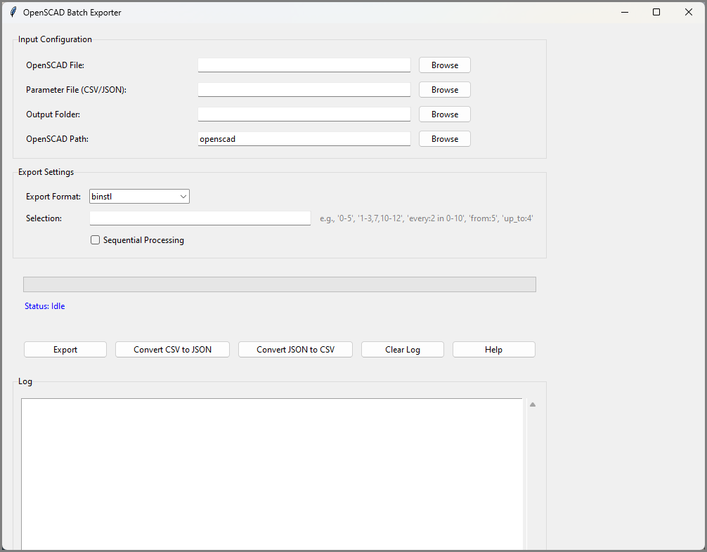
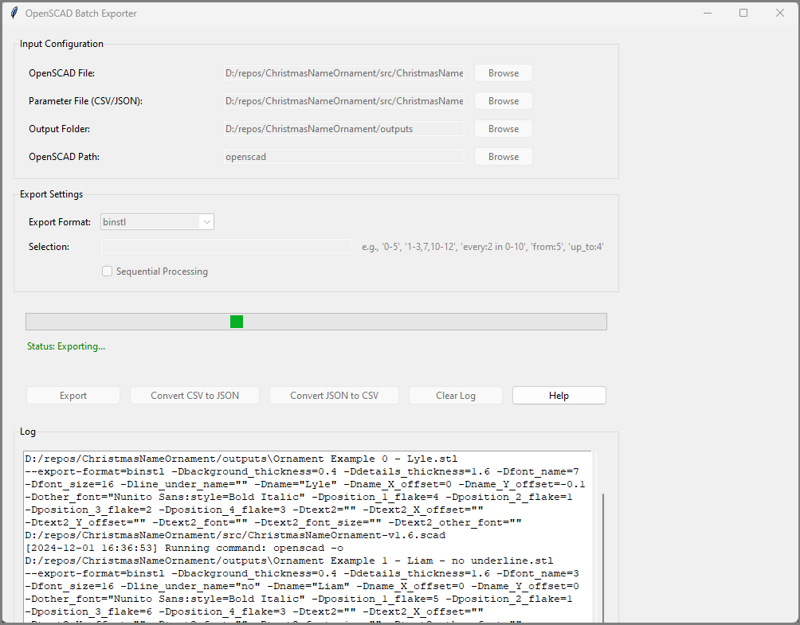
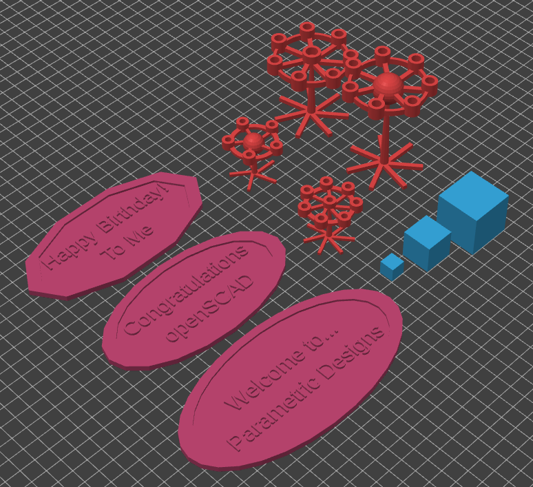

# Summary

The OpenSCAD Batch Exporter is an open-source tool designed to automate the generation of STL models using parametric designs in OpenSCAD. By leveraging parameter files in CSV or JSON format, the tool simplifies the creation of multiple design variations, making it invaluable for research, prototyping, and engineering. Users can rapidly generate tailored design sets with ease, allowing accelerating and enabling novel workflows for applications such as experimental analysis, mass customization, and combinatorial design testing.

This tool addresses critical pain points in research and engineering workflows, such as the need to manually create or export designs from code-based CAD systems. By offering batch exporting capabilities, it supports efficient testing and analysis, promotes the use of parametric models in low-resource environments, and reduces bandwidth requirements by allowing compact script distribution instead of large 3D model files.

Inspired by community contributions and existing batch exporting tools, this project provides a polished and user-friendly solution, bridging gaps in usability and scalability within the OpenSCAD ecosystem.

# Statement of Need

Parametric design tools like OpenSCAD enable researchers and engineers to create highly customizable computational 3D models. However, exporting multiple designs based on varied parameter sets can be time-consuming and error-prone. The OpenSCAD Batch Exporter automates this process, enabling rapid generation of design variants, which is critical for:

1. **Research Applications**:
   - Supports iterative experimental setups, such as those used in agrivoltaics [@pearce_parametric_2021], chemical synthesis [@hou_automatic_2021],  electronic components [@brooks_overcoming_2023], scientific hardware [@hietanen_approaches_2018;@lesuer_omis_2018], medical devices [@gallup_parametric_2020;@petsiuk_partially_2020;@oberloier_overcoming_2022], manufacturing [@beeker_open-source_2018] and hardware prototyping [@oberloier_general_2018].
   - Allows researchers to optimize designs by testing numerous parameter variations without manual intervention.

2. **Mass Customization and Low-Resource Settings**:
   - Facilitates the distribution of compact scripts that can generate large design libraries, reducing storage and bandwidth requirements. This is especially beneficial for researchers in low-resource environments.
   - Promotes distributed manufacturing and parametric design practices [@machado_parametric_2019].

3. **Ease of Use**:
   - Provides a straightforward interface for non-experts, allowing users to interact with pre-made parameter sets without coding knowledge.
   - Bridges the gap between OpenSCAD's code-based environment and accessible design workflows for scientific and engineering applications.

This tool significantly extends the usability of OpenSCAD, making it easier for researchers, educators, and makers to integrate parametric design into their workflows.

# Functionality

The OpenSCAD Batch Exporter allows users to:

- **Batch Export**: Supports exporting STL files in ASCII or binary format using parameter files in CSV or JSON format.
- **Selection Options**: Allows users to target specific parameter sets for export using a flexible selection syntax.
- **Format Conversion**: Includes utilities for converting between CSV and JSON parameter files.
- **Graphical User Interface (GUI)**: Simplifies usage for non-technical users, while retaining a command-line interface for advanced workflows.
- **Cross-Platform Compatibility**: Works on systems where OpenSCAD is installed, leveraging its command-line capabilities.

A command-line interface and an intuitive graphical user interface (GUI) make the tool adaptable for users of varying expertise levels. As illustrated in Figure \autoref{fig:gui_idle}, the OpenSCAD Batch Exporter GUI provides an intuitive interface for configuring batch exports. Users can select the OpenSCAD file, parameter file, and output directory, and specify export settings.

{width=1450px}

During the export process, users can monitor progress and view logs, as shown in Figure \autoref{fig:gui_exporting}.

{width=1450px}

After the batch export completes, the generated STL files can be accessed, exemplified in Figure \autoref{fig:stl_outputs}.

{width=1100px}

# Related Work

This tool builds on efforts by the OpenSCAD community to streamline batch exporting [@openscad_github_wiki;@pinshape_2018]. It integrates and improves upon existing approaches, notably:

- [OpenSCAD Batch Export STL](https://github.com/18107/OpenSCAD-batch-export-stl)
- [OpenSCAD Bulk Export](https://github.com/OutwardBuckle/OpenSCAD-Bulk-Export)

Unlike prior methods and tools, the presented OpenSCAD Batch Exporter offers a complete and user-friendly package, with added functionality for parametric design workflows, broader compatibility, and robust documentation. It is currently being used for an ongoing research project called SnapTessSCAD [@uwo-fastsnaptessscad], a complex OpenSCAD-based design program for computational design of 3D-printable interlocking connectors, validating the robustness and utility of the OpenSCAD Batch Exporter program.

# Acknowledgments

No financial support was received for this project. We thank the OpenSCAD community for their foundational contributions, which inspired this project.

# References
